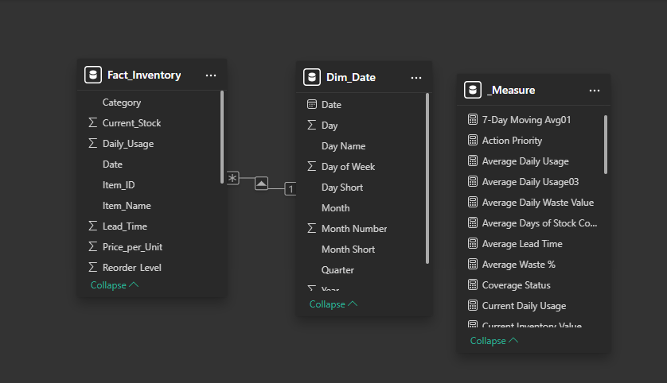
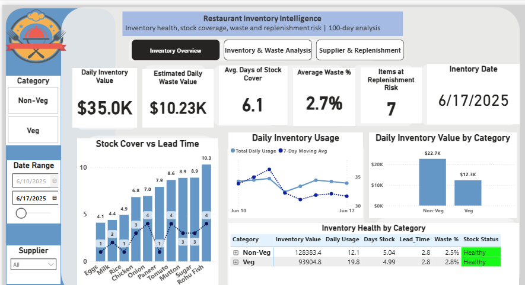
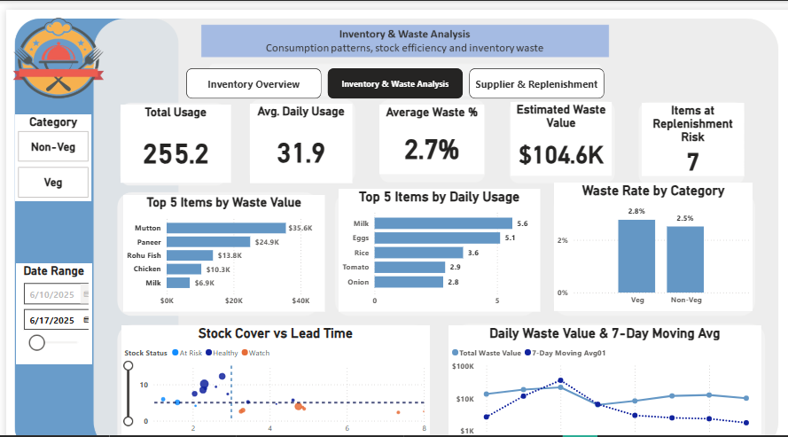
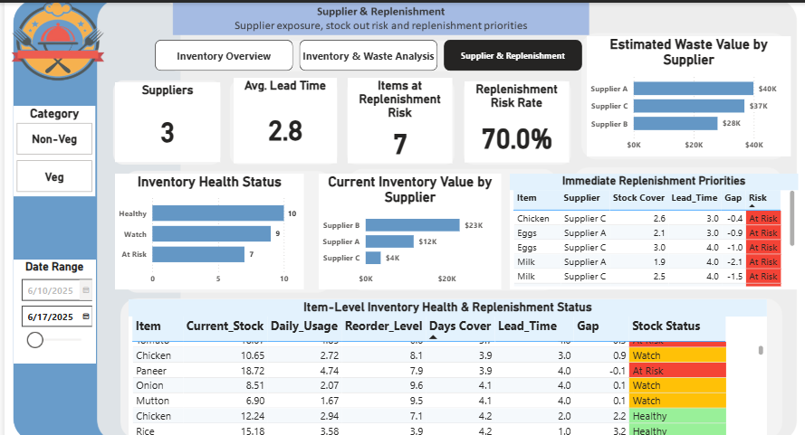

# 100-day restaurant inventory analysis

---

# Restaurant Inventory Intelligence Dashboard

## Table of Contents

1. [Introduction](#introduction)
2. [Business Problem](#business-problem)
3. [Skills & Technologies](#skills--technologies)
4. [Data Modeling](#data-modeling)
5. [Dashboard Analysis](#dashboard-analysis)
   - [Dashboard 1 — Inventory Overview](#dashboard-1--inventory-overview)
   - [Dashboard 2 — Inventory & Waste Analysis](#dashboard-2--inventory--waste-analysis)
   - [Dashboard 3 — Supplier & Replenishment](#dashboard-3--supplier--replenishment)
6. [Business Recommendations](#business-recommendations)
7. [Conclusion](#conclusion)
8. [ Executive Takeaway](#Executive-Takeaway)

## Introduction
This project analyzes **100 days of restaurant inventory data** to understand stock levels, usage patterns, replenishment risks, supplier performance, and waste. Using Power BI, I transformed raw inventory data into an interactive dashboard that provides actionable insights for monitoring inventory health, identifying items requiring replenishment, and tracking waste and stock coverage.

## Business Statement

1. **Limited inventory visibility:** Restaurant inventory data can be difficult to monitor consistently across different items, categories, and suppliers.
2. **Replenishment uncertainty:** Without clear stock coverage and lead-time analysis, it can be difficult to identify items that may require replenishment.
3. **Stock usage monitoring:** Daily usage patterns need to be tracked to understand how quickly inventory is being consumed.
4. **Waste management:** Waste percentage and waste value need to be monitored to identify areas where inventory losses may be occurring.
5. **Supplier comparison:** Supplier performance can be difficult to evaluate without comparing factors such as stock value, lead time, replenishment risk, and waste.
6. **Lack of interactive reporting:** Raw inventory records do not provide an easy way to filter, investigate, and communicate inventory trends and risks to decision-makers.

   ## Skills & Technologies

- Power BI Dashboard Development: Designed a multi-page interactive inventory dashboard.
- Power Query: Cleaned and transformed inventory data for analysis.
- DAX: Created KPIs and measures for inventory monitoring and risk analysis.
- Data Modeling: Built a date dimension and relationships with the inventory fact table.
- Inventory Analysis: Analyzed stock levels, daily usage, stock coverage, and replenishment needs.
- Waste Analysis: Monitored waste percentage and waste value.
- Supplier Analysis: Compared suppliers using inventory, lead-time, and waste-related metrics.
- Data Visualization: Used KPI cards, charts, tables, slicers, and conditional formatting.
- Business Intelligence: Transformed raw inventory records into an interactive decision-support

  ## Modeling

  Built a structured Power BI data model linking the inventory fact table to a dedicated date dimension and DAX measures for analysis.

  

  ## Dashboard Analysis

  ### The Report Comprises of Three Pages
  1. Inventory Overview
  2. Inventory & Waste Analysis
  3. Supplier & Replenishment

 You can interact with the report [here](https://app.powerbi.com/groups/me/reports/9dc5e688-b997-4b15-beef-fd0b90d57c9c/1d3f6022a7547b515954?experience=power-bi)

## Inventory Overview

 

This page is the executive-level view of the restaurant's inventory.

### Filters
- Category: Filter between Non-Veg and Veg.
- Date Range: Select the inventory period to analyze.
- Supplier: Filter the dashboard by supplier.

### KPI Cards
- Daily Inventory Value: Shows the value of inventory for the selected date/filter.
- Estimated Daily Waste Value: Shows the estimated monetary value of daily inventory waste.
- Avg. Days of Stock Cover: Shows approximately how many days the available stock can support current usage.
- Average Waste %: Shows the average percentage of inventory usage considered waste.
- Items at Replenishment Risk: Counts items whose stock coverage indicates a replenishment concern.
- Inventory Date: Shows the selected/current inventory date.

### Charts & Tables
- Stock Cover vs Lead Time: Compares each item's stock coverage with its lead time, helping identify potential replenishment concerns.
-  Daily Inventory Usage: Shows daily inventory usage together with the 7-Day Moving Average to make the usage trend easier to observe.
- Daily Inventory Value by Category: Compares inventory value between Non-Veg and Veg.
- Inventory Health by Category: Provides a category-level summary of inventory value, daily usage, stock days, lead time, waste %, and stock status.

**Main purpose**: Quickly answer, How healthy is the restaurant's inventory right now?

## Inventory & Waste Analysis

This page goes deeper into consumption, inventory waste, and replenishment risk.

### Filters
- Category: Non-Veg / Veg.
- Date Range: Controls the period being analyzed.

### KPI Cards
- Total Usage: Total inventory usage within the selected period.
- Avg. Daily Usage: Average amount used per day.
- Average Waste %: Average waste percentage.
- Estimated Waste Value: Estimated monetary value of the waste.
- Items at Replenishment Risk: Number of items currently identified as requiring replenishment attention.

### Charts
- Top 5 Items by Waste Value: Ranks the items contributing the highest estimated waste value.
- Top 5 Items by Daily Usage: Identifies the items with the highest daily consumption.
- Waste Rate by Category: Compares waste percentages between Veg and Non-Veg.
- Stock Cover vs Lead Time: Helps identify items where available stock coverage may not comfortably cover supplier lead time.
- Daily Waste Value & 7-Day Moving Avg: Tracks waste value over time and compares it with the 7-day moving average.

**Main purpose**: Answer, How much are we using and wasting, which items contribute most to waste, and where is replenishment becoming a concern?

 ## Supplier & Replenishment

 

 This page focuses on supplier performance, inventory exposure, stock coverage, and immediate replenishment priorities.

### Filters
- Date Range: Controls the period being analyzed.

### KPI Cards
- Suppliers: Number of suppliers within the selected period.
- Avg. Lead Time: Average supplier replenishment time.
- Items at Coverage Risk: Number of items currently identified as being at coverage risk.
- Coverage Risk Rate: Percentage of items identified as being at coverage risk.
### Charts & Tables
- Estimated Waste Value by Supplier: Compares estimated waste value across suppliers.
- Inventory Health Status: Categorizes inventory into Healthy, Watch, and At Risk.
- Current Inventory Value by Supplier: Compares inventory value associated with each supplier.
- Immediate Replenishment Priorities: Highlights items requiring immediate replenishment based on stock cover, lead time, and coverage gap.
- Item-Level Inventory Health & Replenishment Status: Provides detailed item-level analysis of stock, usage, reorder level, stock coverage, lead time, gap, and risk status.

**Main purpose**: Answer, Which suppliers are involved, where is inventory exposure concentrated, which items are at risk, and what should be prioritized for replenishment?

## Key Recommendations

- **Prioritize high-waste items**

Focus waste-reduction efforts on items contributing the highest estimated waste value, particularly Mutton, Paneer, Rohu Fish, and Chicken.

Review purchasing quantities, storage practices, shelf-life management, and consumption patterns for these items.

- **Monitor replenishment-risk items**

Prioritize items where Days of Stock Cover is lower than or close to Supplier Lead Time.

These items should be reviewed regularly to reduce the possibility of stock-outs before the next delivery arrives.

- **Use consumption patterns to guide purchasing**

Use current stock, daily usage, stock coverage, and supplier lead time together when making replenishment decisions.

This can help balance the risk of stock-outs against unnecessary overstocking.

- **Monitor supplier lead times**

Track suppliers with longer lead times and identify opportunities to improve replenishment planning or consider alternative sourcing where appropriate.

- **Investigate the drivers of waste**

Rather than focusing only on overall waste percentages, investigate the individual products responsible for the highest waste values.

This allows management to target the areas with the greatest potential financial impact.

- **Establish inventory performance targets**

Consider setting targets for:

- Waste %
- Waste Value
- Days of Stock Cover
- Replenishment Risk
- Daily Consumption

These targets can be used to monitor whether inventory performance improves over time.

## Conclusion

The Restaurant Inventory Intelligence dashboard provides a comprehensive view of inventory value, **consumption, waste, stock coverage, supplier lead time, and replenishment risk.**

The analysis shows that inventory performance is influenced by both **consumption patterns and supplier replenishment timelines**. While most items maintain healthy stock levels, some items have stock coverage that is close to or below supplier lead times, creating potential stock-out risks.

The waste analysis also highlights that a relatively small number of items contribute a significant share of the estimated waste value. This suggests that targeted monitoring of high-waste items could have a greater impact than applying the same controls across all inventory.

Overall, the dashboard transforms inventory data into actionable insights through three stages:

**Inventory Overview → Waste & Consumption Analysis → Supplier & Replenishment Priorities**

This provides management with a clearer basis for identifying risks and making informed inventory decisions.

- **Review inventory performance regularly**

Use the dashboard as a recurring management tool to monitor changes in inventory, consumption, waste, and replenishment risk.

Regular monitoring can help identify emerging problems before they become costly operational issues.

## Executive Takeaway

**The analysis indicates that inventory efficiency can be improved by targeting high-value waste items, monitoring stock coverage against supplier lead times, and using consumption patterns to support smarter replenishment decisions.**
